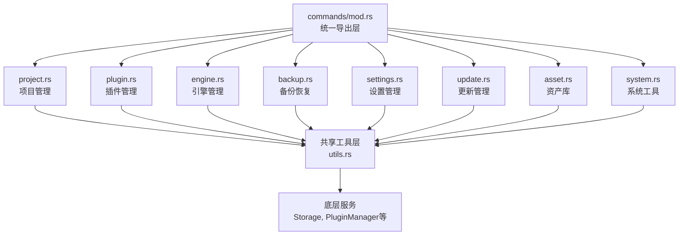

# 1. 问题

当前 `src-tauri/src/commands/mod.rs` 文件存在严重的架构问题，该文件包含4493行代码和93个Tauri命令函数，承担了过多职责，形成了典型的"上帝类"反模式。

## 1.1. **职责过度集中**

该命令模块违反了单一职责原则，将多个完全不同的功能域集中在一个文件中：

- **项目管理**：包含项目扫描、添加、删除、导入、重定位等约15个命令
- **插件管理**：包含插件导入、绑定、更新、删除、存储统计等约20个命令  
- **引擎管理**：包含引擎下载、安装、启动、健康检查等约12个命令
- **备份恢复**：包含备份、恢复、模板管理等约8个命令
- **设置管理**：包含设置获取、保存、数据迁移等约6个命令
- **更新管理**：包含应用更新、插件更新、热更新等约15个命令
- **资产库搜索**：包含资产库搜索、导入等约5个命令
- **系统工具**：包含文件操作、存储路径、日志等约12个命令

这种职责混合导致代码维护困难，不同功能域的代码相互交织，难以进行模块化重构。

## 1.2. **可读性和可维护性差**

由于文件过大，存在以下具体问题：

- **函数定位困难**：在4493行代码中查找特定功能需要大量时间
- **上下文切换频繁**：阅读一个功能的实现时，会被其他不相关的代码干扰
- **重复代码**：相似的功能逻辑在不同位置重复实现，如错误处理、日志记录等
- **修改风险高**：修改一个功能可能影响其他功能，因为它们在同一个文件中

例如，文件中存在多个类似的备份和恢复逻辑，但分散在不同位置，难以统一维护：

```rust
// 第206行：项目插件备份
#[tauri::command]
pub fn list_addon_backups(app: AppHandle, project_id: String) -> Result<Vec<AddonBackupInfo>, String> {
    // 50多行备份列表逻辑
}

// 第540行：数据目录迁移
pub fn migrate_data_dir(app: AppHandle, new_data_dir: String) -> Result<(), String> {
    // 100多行数据迁移逻辑
}
```

## 1.3. **测试复杂度高**

当前的命令模块结构使得单元测试和集成测试变得复杂：

- **依赖关系复杂**：每个命令都依赖 `AppHandle`、`Storage` 等全局状态
- **测试隔离困难**：难以单独测试某个功能域，因为所有功能都在同一个模块中
- **Mock成本高**：需要为整个大文件设置测试环境，而不是针对特定功能

## 1.4. **团队协作效率低**

对于团队开发来说，这种单一大文件结构会带来以下问题：

- **代码冲突频繁**：多个开发者同时修改不同功能时容易产生冲突
- **代码审查困难**：审查一个功能的变更需要阅读整个大文件
- **职责边界不清**：新开发者难以理解哪个功能属于哪个模块
- **扩展性差**：添加新功能时需要修改大文件，增加了出错风险

# 2. 收益

通过将命令模块按功能域拆分，可以显著提升代码质量和开发效率。

## 2.1. **降低复杂度**

将4493行代码拆分为8-10个功能模块，每个模块约300-600行代码：

- **单个文件复杂度降低**：从4493行降低到平均500行左右
- **职责边界清晰**：每个模块只负责一个功能域
- **依赖关系简化**：模块间通过明确的接口通信，减少隐式依赖

预计每个模块的圈复杂度将从当前的25-40降低到8-15之间。

## 2.2. **提升可维护性**

模块化后的代码结构将带来以下维护性提升：

- **快速定位功能**：开发者可以直接在对应的功能模块中找到相关代码
- **减少修改范围**：修改一个功能只需要关注对应的模块，降低影响范围
- **代码复用性提高**：通用功能可以在模块间共享，减少重复代码
- **重构风险降低**：小模块的重构风险远低于大文件重构

## 2.3. **增强可测试性**

拆分后的模块将大大提升测试效率：

- **单元测试更简单**：可以为每个功能模块编写独立的单元测试
- **测试覆盖率提升**：小模块更容易达到高测试覆盖率
- **测试执行速度加快**：只运行相关模块的测试，而不是整个大文件的测试
- **Mock更容易**：每个模块的依赖关系更清晰，Mock更简单

预计单元测试的编写时间将减少40-60%，测试执行时间将减少50-70%。

## 2.4. **改善团队协作**

模块化结构将显著改善团队协作效率：

- **减少代码冲突**：不同开发者可以并行修改不同模块，减少冲突
- **代码审查更高效**：审查者只需要关注相关模块的变更
- **新人上手更快**：清晰的模块结构帮助新开发者快速理解代码组织
- **职责分配更明确**：可以根据功能模块分配开发任务

## 2.5. **提升扩展性**

重构后的架构将更好地支持未来功能扩展：

- **新功能添加简单**：在对应模块中添加新命令，不影响其他模块
- **功能替换容易**：可以独立替换某个功能模块的实现
- **插件化架构基础**：为未来的插件化架构奠定基础

# 3. 方案

采用模块化重构策略，将当前的单一命令文件按功能域拆分为多个独立的命令模块，同时保持向后兼容性。

## 3.1. **模块化拆分架构**

通过将命令模块按功能域拆分，建立清晰的模块边界和依赖关系。



这个架构图显示了重构后的模块结构：
- **统一导出层**：保持向后兼容性，集中管理所有命令
- **功能模块层**：按业务功能拆分的8个独立模块
- **共享工具层**：各模块共享的通用工具函数
- **底层服务层**：现有的存储、插件管理等服务

## 3.2. **创建项目管理模块：解决"职责过度集中"**

### 实施步骤

1. 创建 `commands/project.rs` 文件
2. 将所有项目相关的命令迁移到新模块
3. 提取项目相关的通用工具函数
4. 更新模块导出和Tauri注册

### 代码重构前

```rust
// 在 commands/mod.rs 中，项目相关命令分散在各处
#[tauri::command]
pub fn scan_projects(app: AppHandle, root_dirs: Vec<String>) -> Result<Vec<Project>, String> {
    // 扫描逻辑
}

#[tauri::command]
pub fn get_projects(app: AppHandle) -> Result<Vec<Project>, String> {
    // 获取项目列表
}

#[tauri::command]
pub fn add_project(app: AppHandle, path: String) -> Result<Project, String> {
    // 添加项目
}

// 还有更多项目相关命令...
```

### 代码重构后

```rust
// commands/project.rs - 专门的项目管理模块
use tauri::{AppHandle, Emitter};
use crate::models::Project;
use crate::storage::Storage;
use crate::scanner::ProjectScanner;
use super::utils::{get_storage, log_operation};

/// 扫描指定目录下的Godot项目
#[tauri::command]
pub fn scan_projects(app: AppHandle, root_dirs: Vec<String>) -> Result<Vec<Project>, String> {
    let mut all_projects = Vec::new();
    
    for dir in &root_dirs {
        match ProjectScanner::scan_directory(dir) {
            Ok(projects) => all_projects.extend(projects),
            Err(e) => log_operation(&app, "scan_projects", dir, &format!("扫描失败: {}", e)),
        }
    }
    
    Ok(all_projects)
}

/// 获取所有已管理的项目
#[tauri::command]
pub fn get_projects(app: AppHandle) -> Result<Vec<Project>, String> {
    let storage = get_storage(&app);
    let projects: Vec<Project> = storage.load_or_default("projects.json");
    Ok(projects)
}

/// 添加新项目到管理列表
#[tauri::command]
pub fn add_project(app: AppHandle, path: String) -> Result<Project, String> {
    let project_path = std::path::Path::new(&path);
    if !project_path.exists() {
        return Err("项目路径不存在".to_string());
    }
    
    let project_godot = project_path.join("project.godot");
    if !project_godot.exists() {
        return Err "不是有效的Godot项目".to_string());
    }
    
    let project = ProjectScanner::parse_project(&project_godot)?;
    
    let storage = get_storage(&app);
    let mut projects: Vec<Project> = storage.load_or_default("projects.json");
    
    if projects.iter().any(|p| p.path == project.path) {
        return Err("项目已存在".to_string());
    }
    
    projects.push(project.clone());
    storage.save("projects.json", &projects)?;
    
    log_operation(&app, "add_project", &project.project_id, &format!("添加项目: {}", project.name));
    let _ = app.emit("projects-changed", ());
    
    Ok(project)
}

// 其他项目相关命令...
```

### 模块导出更新

```rust
// commands/mod.rs - 简化为统一导出层
pub mod project;
pub mod plugin;
pub mod engine;
pub mod backup;
pub mod settings;
pub mod update;
pub mod asset;
pub mod system;
pub mod utils;

// 重新导出所有命令，保持向后兼容
pub use project::*;
pub use plugin::*;
pub use engine::*;
pub use backup::*;
pub use settings::*;
pub use update::*;
pub use asset::*;
pub use system::*;
```

## 3.3. **创建插件管理模块：解决"职责过度集中"**

### 实施步骤

1. 创建 `commands/plugin.rs` 文件
2. 迁移所有插件相关命令（约20个）
3. 提取插件管理的通用逻辑
4. 建立清晰的插件操作接口

### 代码重构前

```rust
// 插件相关命令分散在 mod.rs 中
#[tauri::command]
pub fn import_plugin_from_local(app: AppHandle, path: String) -> Result<Plugin, String> {
    if !std::path::Path::new(&path).exists() {
        return Err("指定的插件路径不存在".to_string());
    }
    let manager = get_plugin_manager(&app);
    let new_plugin = manager.import_from_local(&path)?;
    upsert_plugin(&app, &new_plugin, "import_plugin", &path)
}

#[tauri::command]
pub fn import_plugin_from_git(app: AppHandle, url: String) -> Result<Plugin, String> {
    if url.is_empty() {
        return Err("请输入 Git 仓库地址".to_string());
    }
    let manager = get_plugin_manager(&app);
    let new_plugin = manager.import_from_git(&url, &app)?;
    upsert_plugin(&app, &new_plugin, "import_plugin_git", &url)
}

// 更多插件命令...
```

### 代码重构后

```rust
// commands/plugin.rs - 专门的插件管理模块
use tauri::{AppHandle, Emitter};
use crate::models::{Plugin, ProjectBinding};
use crate::plugin_manager::PluginManager;
use super::utils::{get_storage, get_plugin_manager, log_operation};

/// 从本地文件系统导入插件
#[tauri::command]
pub fn import_plugin_from_local(app: AppHandle, path: String) -> Result<Plugin, String> {
    validate_plugin_path(&path)?;
    
    let manager = get_plugin_manager(&app);
    let new_plugin = manager.import_from_local(&path)
        .map_err(|e| format!("导入本地插件失败: {}", e))?;
    
    upsert_plugin(&app, &new_plugin, "import_plugin", &path)
}

/// 从Git仓库导入插件
#[tauri::command]
pub fn import_plugin_from_git(app: AppHandle, url: String) -> Result<Plugin, String> {
    validate_git_url(&url)?;
    
    let manager = get_plugin_manager(&app);
    let new_plugin = manager.import_from_git(&url, &app)
        .map_err(|e| format!("从Git导入插件失败: {}", e))?;
    
    upsert_plugin(&app, &new_plugin, "import_plugin_git", &url)
}

/// 获取所有插件列表
#[tauri::command]
pub fn get_plugins(app: AppHandle) -> Result<Vec<Plugin>, String> {
    let storage = get_storage(&app);
    let plugins: Vec<Plugin> = storage.load_or_default("plugins.json");
    Ok(plugins)
}

/// 删除指定插件
#[tauri::command]
pub fn remove_plugin(app: AppHandle, plugin_id: String) -> Result<(), String> {
    let storage = get_storage(&app);
    let mut plugins: Vec<Plugin> = storage.load_or_default("plugins.json");
    
    let plugin = plugins.iter()
        .find(|p| p.plugin_id == plugin_id)
        .ok_or("未找到指定插件".to_string())?;
    
    let plugin_name = plugin.name.clone();
    let plugin_dir = get_data_dir(&app).join("plugins").join(&plugin_id);
    
    if plugin_dir.exists() {
        std::fs::remove_dir_all(&plugin_dir)
            .map_err(|e| format!("删除插件文件失败: {}", e))?;
    }
    
    plugins.retain(|p| p.plugin_id != plugin_id);
    storage.save("plugins.json", &plugins)?;
    
    log_operation(&app, "remove_plugin", &plugin_id, &format!("删除插件: {}", plugin_name));
    let _ = app.emit("plugins-changed", ());
    
    Ok(())
}

// 辅助函数
fn validate_plugin_path(path: &str) -> Result<(), String> {
    if path.is_empty() {
        return Err("插件路径不能为空".to_string());
    }
    if !std::path::Path::new(path).exists() {
        return Err("指定的插件路径不存在".to_string());
    }
    Ok(())
}

fn validate_git_url(url: &str) -> Result<(), String> {
    if url.is_empty() {
        return Err("请输入Git仓库地址".to_string());
    }
    if !url.starts_with("http://") && !url.starts_with("https://") && !url.starts_with("git@") {
        return Err("请输入有效的Git仓库地址".to_string());
    }
    Ok(())
}

fn upsert_plugin(app: &AppHandle, new_plugin: &Plugin, operation: &str, source_desc: &str) -> Result<Plugin, String> {
    let storage = get_storage(app);
    let mut plugins: Vec<Plugin> = storage.load_or_default("plugins.json");
    
    let existing_idx = plugins.iter().position(|p| p.source.url == new_plugin.source.url);
    if let Some(idx) = existing_idx {
        plugins[idx].versions.extend(new_plugin.versions.clone());
        if !new_plugin.content_hash.is_empty() {
            plugins[idx].content_hash = new_plugin.content_hash.clone();
        }
        let result = plugins[idx].clone();
        storage.save("plugins.json", &plugins)?;
        log_operation(app, operation, source_desc, &format!("为插件 {} 添加新版本", new_plugin.name));
        Ok(result)
    } else {
        plugins.push(new_plugin.clone());
        storage.save("plugins.json", &plugins)?;
        log_operation(app, operation, source_desc, &format!("导入插件: {}", new_plugin.name));
        Ok(new_plugin.clone())
    }
}
```

## 3.4. **创建共享工具模块：解决"重复代码"**

### 实施步骤

1. 创建 `commands/utils.rs` 文件
2. 提取各模块共享的工具函数
3. 统一错误处理和日志记录
4. 提供通用的存储和状态访问函数

### 代码重构后

```rust
// commands/utils.rs - 共享工具模块
use tauri::{AppHandle, Emitter};
use crate::storage::Storage;
use crate::plugin_manager::PluginManager;
use crate::operation_log::OperationLogger;
use std::path::PathBuf;

/// 获取应用配置目录
pub fn get_config_dir(app: &AppHandle) -> PathBuf {
    app.path().app_data_dir()
        .expect("Failed to get app data directory")
}

/// 获取应用数据目录
pub fn get_data_dir(app: &AppHandle) -> PathBuf {
    let config_dir = get_config_dir(app);
    let config_storage = Storage::new(config_dir.clone());
    let settings: crate::models::Settings = config_storage.load_or_default("settings.json");
    
    if settings.custom_data_dir.is_empty() {
        config_dir
    } else {
        PathBuf::from(&settings.custom_data_dir)
    }
}

/// 获取存储实例
pub fn get_storage(app: &AppHandle) -> Storage {
    Storage::new(get_data_dir(app))
}

/// 获取插件管理器实例
pub fn get_plugin_manager(app: &AppHandle) -> PluginManager {
    let plugins_dir = get_data_dir(app).join("plugins");
    PluginManager::new(plugins_dir)
}

/// 获取操作日志记录器
pub fn get_logger(app: &AppHandle) -> OperationLogger {
    let data_dir = get_data_dir(app);
    OperationLogger::new(data_dir)
}

/// 记录操作日志
pub fn log_operation(app: &AppHandle, action: &str, target: &str, detail: &str) {
    let logger = get_logger(app);
    if let Err(e) = logger.log(action, target, detail) {
        eprintln!("Failed to write operation log: {}", e);
    }
}

/// 记录错误日志
pub fn log_error(app: &AppHandle, action: &str, target: &str, error: &str) {
    let logger = get_logger(app);
    if let Err(e) = logger.log_error(action, target, error) {
        eprintln!("Failed to write error log: {}", e);
    }
}

/// 统一的文件大小格式化
pub fn format_size(bytes: u64) -> String {
    const KB: u64 = 1024;
    const MB: u64 = 1024 * KB;
    const GB: u64 = 1024 * MB;
    
    if bytes >= GB {
        format!("{:.2} GB", bytes as f64 / GB as f64)
    } else if bytes >= MB {
        format!("{:.2} MB", bytes as f64 / MB as f64)
    } else if bytes >= KB {
        format!("{:.2} KB", bytes as f64 / KB as f64)
    } else {
        format!("{} B", bytes)
    }
}

/// 计算目录大小
pub fn dir_size(path: &Path) -> u64 {
    walkdir::WalkDir::new(path)
        .into_iter()
        .filter_map(|e| e.ok())
        .filter_map(|e| e.metadata().ok())
        .filter(|m| m.is_file())
        .map(|m| m.len())
        .sum()
}

/// 验证路径是否存在
pub fn validate_path_exists(path: &str) -> Result<(), String> {
    if path.is_empty() {
        return Err("路径不能为空".to_string());
    }
    if !std::path::Path::new(path).exists() {
        return Err(format!("路径不存在: {}", path));
    }
    Ok(())
}

/// 统一的事件发送
pub fn emit_event<T: serde::Serialize>(app: &AppHandle, event: &str, payload: &T) {
    if let Err(e) = app.emit(event, payload) {
        eprintln!("Failed to emit event '{}': {}", event, e);
    }
}
```

## 3.5. **更新Tauri命令注册：解决"测试复杂度高"**

### 实施步骤

1. 更新 `lib.rs` 中的命令注册
2. 按模块分组注册命令
3. 添加模块级别的文档注释
4. 优化错误处理

### 代码重构后

```rust
// src-tauri/src/lib.rs - 更新命令注册
.invoke_handler(tauri::generate_handler![
    // 项目管理命令
    commands::scan_projects,
    commands::get_projects,
    commands::add_project,
    commands::import_project_from_git,
    commands::remove_project,
    commands::relocate_project,
    commands::detect_moved_projects,
    commands::confirm_project_relocation,
    commands::sync_projects,
    commands::batch_remove_projects,
    
    // 插件管理命令
    commands::import_plugin_from_local,
    commands::import_plugin_from_git,
    commands::import_plugin_from_url,
    commands::get_plugins,
    commands::remove_plugin,
    commands::bind_plugin,
    commands::unbind_plugin,
    commands::apply_changes,
    commands::get_plugin_bindings,
    commands::scan_project_plugins,
    commands::import_plugins_from_projects,
    commands::toggle_plugin_favorite,
    commands::batch_remove_plugins,
    commands::batch_bind_plugins,
    commands::batch_unbind_plugins,
    commands::batch_apply_changes,
    commands::get_plugin_storage_stats,
    commands::remove_plugin_version,
    commands::update_git_plugin,
    commands::batch_update_plugins,
    commands::check_plugin_updates,
    commands::resolve_plugin_dependencies,
    commands::check_plugin_duplicate,
    commands::check_binding_health,
    commands::repair_binding,
    
    // 引擎管理命令
    commands::register_engine,
    commands::get_engines,
    commands::remove_engine,
    commands::rename_engine,
    commands::launch_engine,
    commands::check_engine_health,
    commands::auto_discover_engines,
    commands::check_godot_updates,
    commands::fetch_remote_engine_versions,
    commands::download_engine,
    commands::download_engine_from_url,
    commands::cancel_engine_download,
    commands::get_active_downloads,
    commands::cleanup_download_temp,
    
    // 备份恢复命令
    commands::list_addon_backups,
    commands::restore_addon_backup,
    commands::save_as_template,
    commands::list_templates,
    commands::delete_template,
    commands::apply_template_to_project,
    commands::backup_data,
    commands::restore_data,
    commands::reset_data,
    
    // 设置管理命令
    commands::get_settings,
    commands::save_settings,
    commands::get_storage_paths,
    commands::migrate_data_dir,
    commands::get_default_scan_dirs,
    commands::check_auto_setup_needed,
    commands::mark_auto_setup_done,
    
    // 更新管理命令
    commands::skip_app_version,
    commands::check_app_update,
    commands::install_app_update,
    commands::check_all_updates,
    commands::get_app_version,
    commands::check_hot_update,
    commands::install_hot_update,
    commands::rollback_hot_update,
    commands::get_current_hot_update_version,
    commands::get_update_history,
    commands::clear_update_history,
    
    // 资产库命令
    commands::search_asset_library,
    commands::import_from_asset_library,
    commands::get_asset_library_configure,
    commands::get_asset_detail,
    commands::import_from_asset_library_with_progress,
    
    // 系统工具命令
    commands::get_dashboard_stats,
    commands::auto_scan_projects,
    commands::restart_fs_watcher,
    commands::get_total_storage_stats,
    commands::cleanup_orphaned_plugin_dirs,
    commands::get_operation_logs,
    commands::log_client_error,
    commands::update_project_group,
    commands::get_project_groups,
    commands::open_in_file_manager,
    commands::read_file_as_base64,
]))
```

## 3.6. **建立模块测试框架：解决"测试复杂度高"**

### 实施步骤

1. 为每个模块创建对应的测试文件
2. 提供通用的测试工具函数
3. 建立Mock数据和环境
4. 编写关键功能的单元测试

### 代码重构后

```rust
// commands/project_test.rs - 项目模块测试
#[cfg(test)]
mod tests {
    use super::*;
    use tauri::test::mock_app;
    
    #[test]
    fn test_scan_projects_empty_dir() {
        let app = mock_app();
        let result = scan_projects(app, vec!["/nonexistent".to_string()]);
        assert!(result.is_ok());
        assert!(result.unwrap().is_empty());
    }
    
    #[test]
    fn test_add_project_invalid_path() {
        let app = mock_app();
        let result = add_project(app, "/invalid/path".to_string());
        assert!(result.is_err());
    }
    
    #[test]
    fn test_get_projects_empty() {
        let app = mock_app();
        let result = get_projects(app);
        assert!(result.is_ok());
        assert!(result.unwrap().is_empty());
    }
}

// commands/plugin_test.rs - 插件模块测试
#[cfg(test)]
mod tests {
    use super::*;
    use tauri::test::mock_app;
    
    #[test]
    fn test_import_plugin_invalid_path() {
        let app = mock_app();
        let result = import_plugin_from_local(app, "/nonexistent/plugin".to_string());
        assert!(result.is_err());
    }
    
    #[test]
    fn test_import_plugin_invalid_git_url() {
        let app = mock_app();
        let result = import_plugin_from_git(app, "".to_string());
        assert!(result.is_err());
    }
    
    #[test]
    fn test_get_plugins_empty() {
        let app = mock_app();
        let result = get_plugins(app);
        assert!(result.is_ok());
        assert!(result.unwrap().is_empty());
    }
}

// commands/utils_test.rs - 工具模块测试
#[cfg(test)]
mod tests {
    use super::*;
    
    #[test]
    fn test_format_size() {
        assert_eq!(format_size(500), "500 B");
        assert_eq!(format_size(2048), "2.00 KB");
        assert_eq!(format_size(2_000_000), "1.91 MB");
        assert_eq!(format_size(2_000_000_000), "1.86 GB");
    }
    
    #[test]
    fn test_validate_path_exists() {
        assert!(validate_path_exists("").is_err());
        assert!(validate_path_exists("/nonexistent/path").is_err());
    }
}
```

# 4. 回归范围

本次重构主要涉及代码组织结构的调整，不改变业务逻辑，因此回归测试应重点关注功能完整性和兼容性。

## 4.1. 主链路

### 项目管理主流程
1. **项目扫描流程**
   - 用户启动应用 → 自动扫描默认目录 → 显示发现的项目
   - 手动扫描指定目录 → 验证项目有效性 → 添加到项目列表
   - 关键检查点：扫描结果正确性、项目信息完整性、事件触发

2. **项目导入流程**
   - 从Git导入项目 → 克隆仓库 → 解析项目信息 → 保存到存储
   - 本地添加项目 → 验证路径 → 解析project.godot → 添加到管理列表
   - 关键检查点：导入成功率、项目信息准确性、存储正确性

### 插件管理主流程
1. **插件导入流程**
   - 从本地导入插件 → 验证路径 → 解析插件信息 → 保存到插件库
   - 从Git导入插件 → 克隆仓库 → 解析插件元数据 → 注册插件
   - 关键检查点：导入成功率、插件版本管理、依赖解析

2. **插件绑定流程**
   - 选择项目 → 选择插件 → 创建绑定关系 → 应用插件到项目
   - 批量绑定插件 → 验证兼容性 → 批量应用 → 生成绑定报告
   - 关键检查点：绑定关系正确性、文件应用准确性、冲突处理

### 引擎管理主流程
1. **引擎下载流程**
   - 选择引擎版本 → 开始下载 → 显示进度 → 完成安装
   - 从URL下载 → 验证文件 → 解压安装 → 注册引擎
   - 关键检查点：下载完整性、安装正确性、引擎可用性

2. **引擎启动流程**
   - 选择引擎 → 选择项目 → 启动引擎 → 传递项目参数
   - 关键检查点：引擎启动成功率、项目参数传递、进程管理

## 4.2. 边界情况

### 异常场景
1. **文件系统异常**
   - 项目目录被删除或移动
   - 插件文件损坏或权限不足
   - 存储目录不可写
   - 磁盘空间不足

2. **网络异常**
   - Git仓库连接失败
   - 下载中断或超时
   - API请求失败
   - 网络权限问题

3. **数据异常**
   - 配置文件损坏
   - JSON解析失败
   - 数据版本不兼容
   - 并发修改冲突

### 特殊业务场景
1. **批量操作场景**
   - 批量导入多个项目
   - 批量更新插件
   - 批量绑定插件到多个项目
   - 批量删除操作

2. **版本管理场景**
   - 插件多版本共存
   - 引擎版本降级
   - 数据迁移版本兼容
   - 配置格式升级

3. **并发操作场景**
   - 同时扫描和导入项目
   - 同时下载多个引擎
   - 同时更新多个插件
   - 前端多次调用同一命令

### 性能边界场景
1. **大数据量场景**
   - 项目数量超过1000个
   - 插件数量超过500个
   - 单个插件文件超过1GB
   - 备份文件数量超过100个

2. **长时间操作场景**
   - 大文件下载超过1小时
   - 批量操作超过10分钟
   - 扫描大量目录
   - 复杂的依赖解析

在回归测试中，需要特别关注重构后的模块化是否保持了原有的功能行为，确保所有命令的输入输出接口保持一致，事件触发机制正常工作。